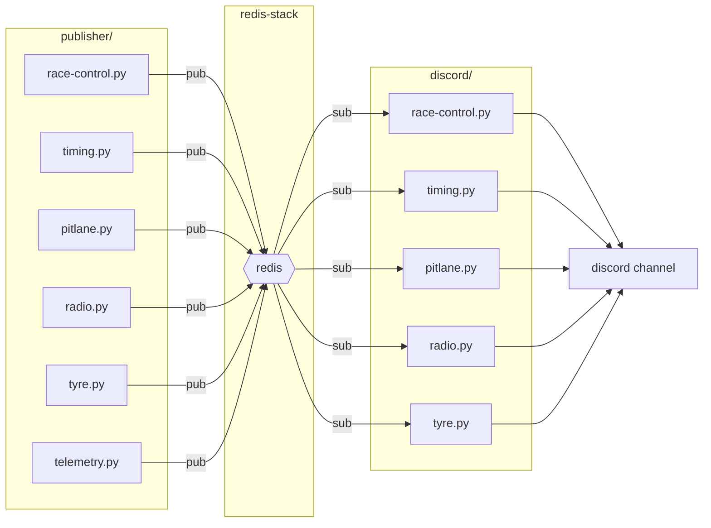
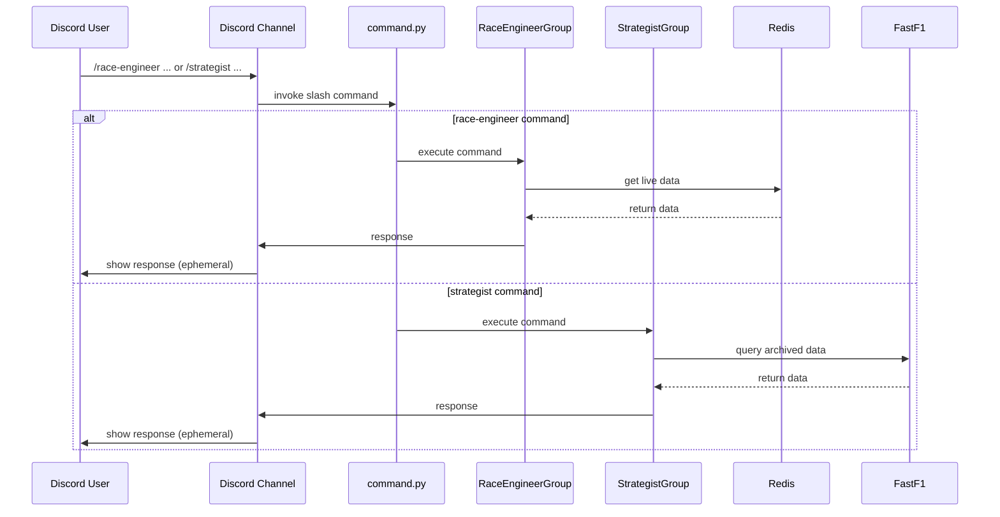

# Pitwall

Pitwall is a discord bot that connect to the [live timing API](https://livetiming.formula1.com/) endpoint, process and push live messages into channel of your choice. It also provide a handful of slash commands for on demand infomation. 

## Push Messages
| Message type | Available Session type | Description |
|--------------|------------------------|-------------|
| Race control messages | ALL | Messages from race control. eg. Flags, VSC/SC, penalty & investigation, lap time deleted |
| Quickest overall lap time | ALL | Notify when driver recorded questest lap time in the session (purple lap) |
| Personal best lap time | Qualifying, Sprint Shootout | Notify when driver improved his/her personal best lap time in the session (green lap) |
| Knocked out | Qualifying, Sprint Shootout | Notify when driver is knocked out of qualifying  |
| Tyre change | Race, Sprint | Notify with compound when driver change tyre |
| Race leader | Race, Sprint | Notify when race leader changed |
| Retired | Race, Sprint | Notify when driver retired from the session |
| Pit Stop | Race, Sprint | Notify pit stop time. (if available)|
| Team tasio | ALL | Transcribed team radio messages | 

### Architecture

## Slash Commands
All slash command responses except `/pitwall-help` are ephemeral, meaning only you can see them.

| Command | Parameters | Description |
|---|---|---|
| `/pitwall-help` | | Shows a list of all available commands. |
| **Strategist Commands** | | _Commands for the Strategist._ |
| `/strategist schedule` | `event_name` (optional) | Get the F1 schedule for an event, or the next upcoming event. |
| `/strategist trackmap` | `event_name` (optional) | Displays the track map for an event, or the next upcoming event. |
| `/strategist pace` | | Generates a violin plot of lap times from all completed sessions for the current event. |
| **Race Engineer Commands** | | _Commands for the Race Engineer._ |
| `/race-engineer tyres` | | Shows the current tyre compound and tyre age for all active drivers. |
| `/race-engineer track_condition` | | Displays the current track status and weather conditions. |
| `/race-engineer gap_in_front` | | Shows each driver's lap time and gap to the car ahead. |
| `/race-engineer gap_to_lead` | | Shows each driver's lap time and gap to the session leader. |
| `/race-engineer position` | | Plots each driver's position change throughout the race or sprint. |

This is a continuation of the [Race Control Bot](https://gitlab.com/CSniper/race-control-bot) project. 

### Architecture

## Deployment
Container image is published to dockerhub as [docker.io/csniper/pitwall](https://hub.docker.com/r/csniper/pitwall/tags). Please refer to `compose.yaml`, `publish.env.example`, `discord.env.example` for setting up the service using podman compose

## Acknowledgment

This project would not be possible without referencing [Philipp Schaefer (theOehrly)](https://github.com/theOehrly)'s work [FastF1](https://github.com/theOehrly/Fast-F1). If you want to know more about how to use the live timing endpoint, definitely check out his code. 

Big thanks to Daniel Chan and everyone in his Discord F1 channel for feedbacks and support. Your feedback improved this project a lot, and your support makes this project meaningful.

Chuenhei Tai contributed radio transcription part to the original Race Control Bot project, Integration was not possible with the old monolithic serial architecture. With the async micro-service architecture, it is finally possible to integrate transcription feature into the system. 

## Disclaimer
This is an unofficial project and is not associated in any way with the Formula 1 company, teams, drivers, organizers, organizations, management or governing bodies. F1, FORMULA ONE, FORMULA 1, FIA FORMULA ONE WORLD CHAMPIONSHIP, GRAND PRIX and related marks are trademarks of Formula One Licensing B.V.

The source code of this project is released under the MIT license, please refer to the LICENSE file for details. 
