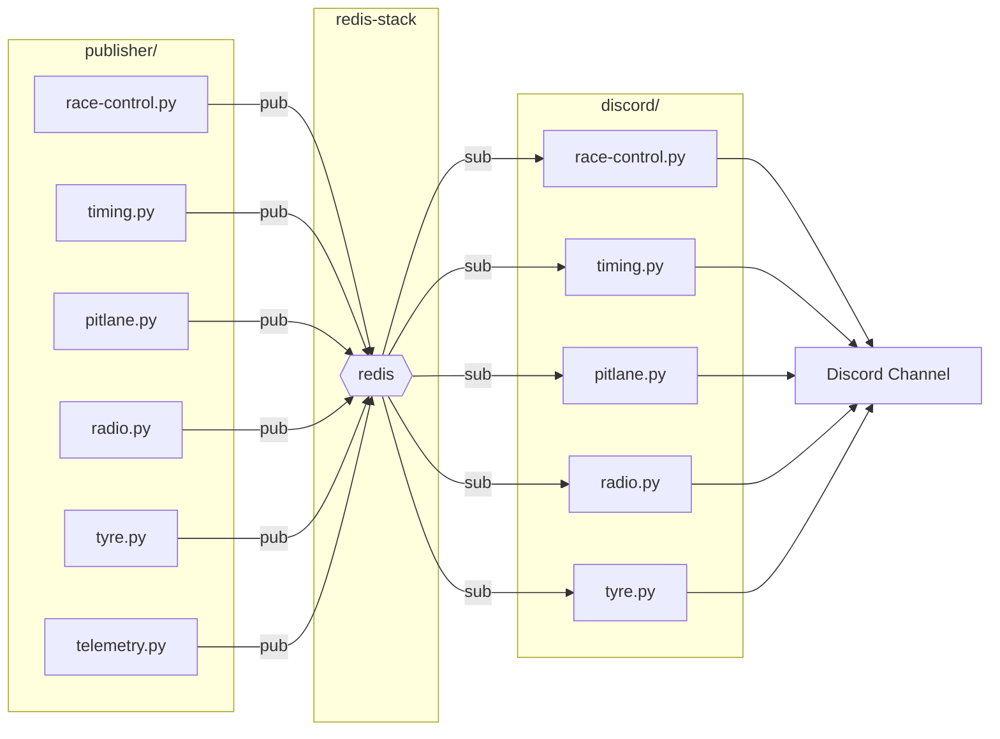
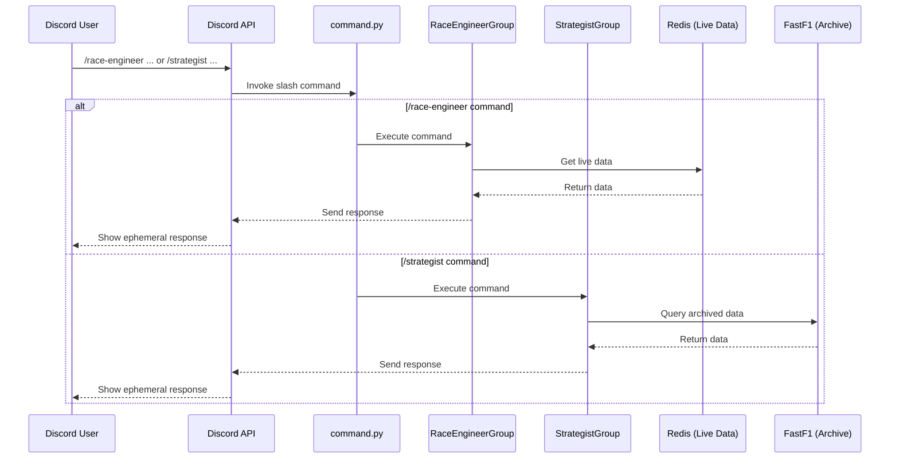

# Pitwall

<p align="center">
  <a href="https://hub.docker.com/r/csniper/pitwall/tags"></a>
  <a href="LICENSE"></a>
</p>

Pitwall is a comprehensive Discord bot for Formula 1 enthusiasts. It connects to a live timing data feed to push real-time race updates to your Discord channel and provides a rich set of slash commands for on-demand information.

## Features

Pitwall offers two main types of features: live, automated notifications pushed to your channel, and on-demand slash commands for detailed analysis.

### Live Notifications (Push Messages)

Get real-time updates from the track directly in your Discord channel.

| Message Type | Available Session(s) | Description |
|---|---|---|
| Race Control Messages | All | Official messages from Race Control (e.g., flags, SC/VSC, penalties, investigations). |
| Quickest Overall Lap | All | Notifies when a driver sets the fastest lap of the session (a purple lap). |
| Personal Best Lap | Qualifying, Sprint Shootout | Notifies when a driver improves their personal best lap time (a green lap). |
| Knocked Out | Qualifying, Sprint Shootout | Announces when a driver is knocked out of a qualifying session. |
| Tyre Change | Race, Sprint | Reports the new tyre compound when a driver makes a pit stop. |
| Race Leader Change | Race, Sprint | Announces when the lead of the race changes. |
| Driver Retirement | Race, Sprint | Notifies when a driver retires from the session. |
| Pit Stop Time | Race, Sprint | Reports a driver's pit stop time, if available. |
| Team Radio | All | Posts transcriptions of team radio messages. |

### On-Demand Slash Commands

Use slash commands to get specific information. All command responses (except for `/pitwall-help`) are ephemeral, meaning only you can see them.

| Command | Parameters | Description |
|---|---|---|
| `/pitwall-help` | | Shows a list of all available commands. |
| **Strategist Commands** | | _Commands for the Strategist._ |
| `/strategist schedule` | `event_name` (optional) | Get the F1 schedule for a specific event, or the next upcoming event. |
| `/strategist trackmap` | `event_name` (optional) | Displays the track map for a specific event, or the next upcoming event. |
| `/strategist driver_pace` | | Generates a box plot of lap times for each driver from all completed sessions. |
| `/strategist team_pace` | | Generates a box plot of lap times for each team from all completed sessions. |
| `/strategist driver_standing` |  | Displays the current World Driver Championship standings. |
| `/strategist team_standing` |  | Displays the current World Constructor Championship standings. |
| **Race Engineer Commands** | | _Commands for the Race Engineer._ |
| `/race-engineer tyres` | | Shows the current tyre compound and tyre age for all active drivers. |
| `/race-engineer track_condition` | | Displays the current track status and weather conditions. |
| `/race-engineer gap_in_front` | | Shows each driver's lap time and gap to the car ahead. |
| `/race-engineer gap_to_lead` | | Shows each driver's lap time and gap to the session leader. |
| `/race-engineer position` | | Plots each driver's position change throughout the race or sprint. |

## Architecture

Pitwall uses a microservice-based architecture with a Redis message broker to decouple data processing from Discord notifications.

-   **Publisher Services (`publisher/`)**: A set of Python scripts that connect to the live timing data source. Each script is responsible for a specific type of data (e.g., `timing.py`, `race-control.py`), which it processes and publishes to a specific Redis channel.
-   **Redis (`redis-stack`)**: Acts as a high-speed message broker, receiving data from the publishers and holding it for the consumers.
-   **Discord Services (`discord/`)**: A set of Python scripts that subscribe to Redis channels. When a message is received, the consumer script formats it and sends it to the configured Discord webhook or responds to a slash command.

### Data Flow for Push Messages


### Data Flow for Slash Commands


## Getting Started

The project is containerized and designed to be run with `podman-compose` or `docker-compose`.

### 1. Clone the Repository
```bash
git clone https://gitlab.com/CSniper/pitwall.git
cd pitwall
```

### 2. Configure Environment Variables
You will need to create two environment files: one for the publisher services and one for the Discord bot. Examples are provided.

**For the publisher:**
```bash
cp publish.env.example publish.env
```
Edit `publish.env` with your settings.

**For the Discord bot:**
```bash
cp discord.env.example discord.env
```
Edit `discord.env` and add your Discord Bot Token.

See the **Configuration** section below for details on the variables.

### 3. Run with Compose
You can use the standard `compose.yaml` for a production-like setup or `compose.dev.yaml` for development.

**Using Podman Compose:**
```bash
# For production
podman-compose -f compose.yaml up -d

# For development (includes mock API)
podman-compose -f compose.dev.yaml up -d
```

**Using Docker Compose:**
```bash
# For production
docker-compose -f compose.yaml up -d

# For development (includes mock API)
docker-compose -f compose.dev.yaml up -d
```

## Configuration

The following environment variables are used to configure the services:

### `discord.env`
| Variable | Required | Description |
|---|---|---|
| `DISCORD_BOT_TOKEN` | **Yes** | The token for your Discord bot application. |
| `DISCORD_WEBHOOK` | **Yes** | The webhook URL for the channel where push messages will be sent. |
| `LOG_LEVEL` | No | The logging level (e.g., `INFO`, `DEBUG`). Defaults to `WARNING`. |
| `VER_TAG` | No | A version tag to append to bot messages. |
| `MSG_STYLE_PATH` | No | Path to a custom `style.json` file to override default colors and symbols. |

### `publish.env`
| Variable | Required | Description |
|---|---|---|
| `REDIS_HOST` | No | The hostname of the Redis service. Defaults to `redis`. |
| `REDIS_PORT` | No | The port for the Redis service. Defaults to `6379`. |
| `RETRY` | No | Whether the publisher should retry connecting on failure. Defaults to `True`. |

## Acknowledgment

This project is a continuation of the [Race Control Bot](https://gitlab.com/CSniper/race-control-bot) and would not be possible without referencing [Philipp Schaefer (theOehrly)](https://github.com/theOehrly)'s incredible work on [FastF1](https://github.com/theOehrly/Fast-F1). If you want to know more about how to use the live timing endpoint, definitely check out his code.

Big thanks to Daniel Chan and everyone in his Discord F1 channel for feedbacks and support. Your feedback improved this project a lot, and your support makes this project meaningful.

Chuenhei Tai contributed the radio transcription part to the original Race Control Bot project. Integration was not possible with the old monolithic serial architecture, but with the new async micro-service architecture, it is finally possible to integrate this feature into the system.

## Disclaimer
This is an unofficial project and is not associated in any way with the Formula 1 companies. F1, FORMULA ONE, FORMULA 1, FIA FORMULA ONE WORLD CHAMPIONSHIP, GRAND PRIX and related marks are trademarks of Formula One Licensing B.V.

## License
The source code of this project is released under the MIT license. Please refer to the `LICENSE` file for details. 
